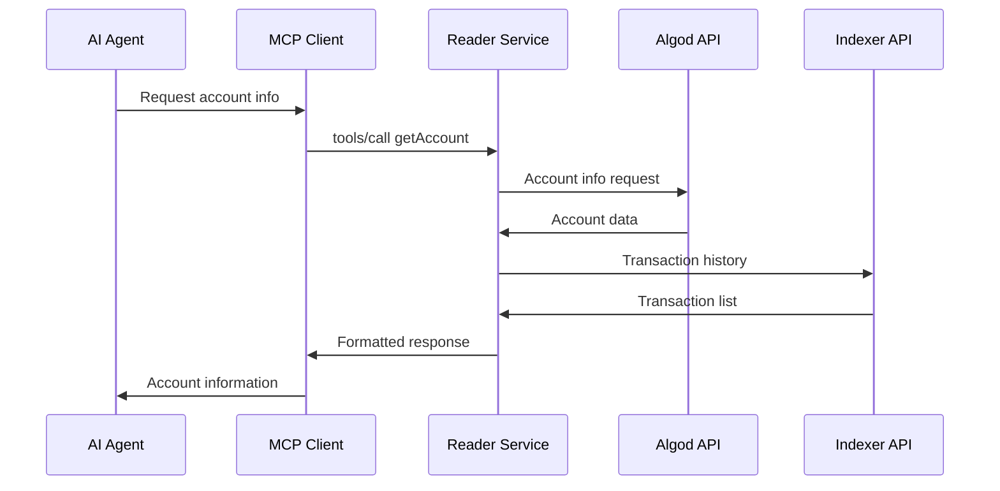
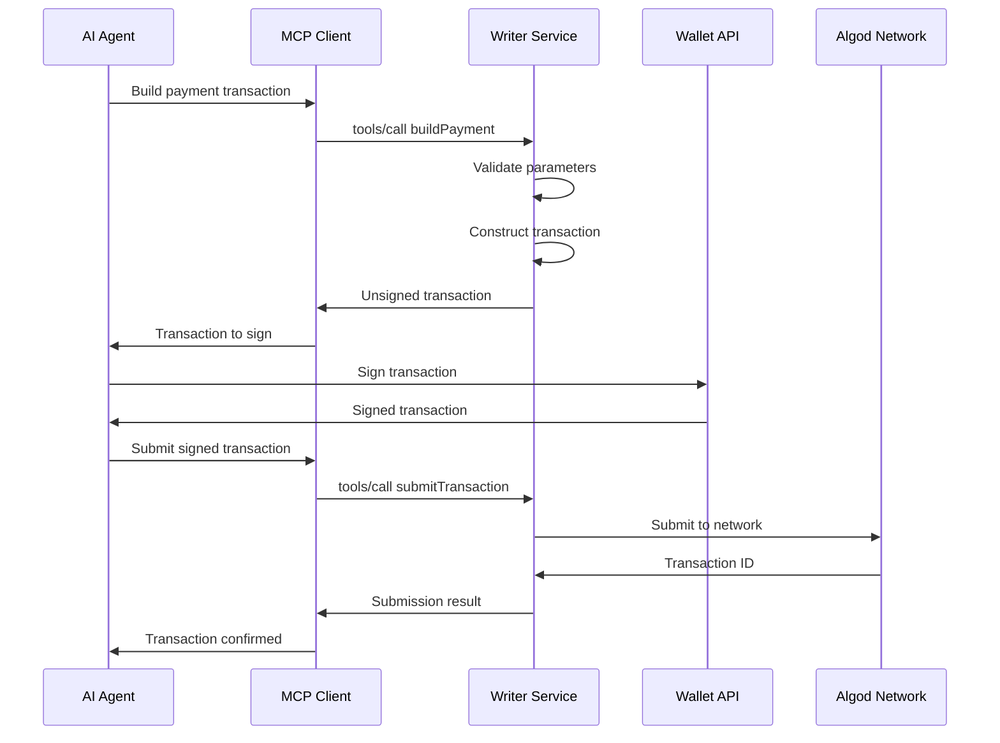

# MCP Protocol Integration Architecture

## Overview

The Algorand MCP services implement the Model Context Protocol (MCP) to provide AI agents with secure, standardized access to Algorand blockchain functionality. This document outlines the architecture and integration patterns.

## MCP Protocol Implementation

### Protocol Layer Architecture

```
┌─────────────────────────────────────────────────────────────┐
│                    AI Agent/Client                          │
└─────────────────────┬───────────────────────────────────────┘
                      │ MCP Protocol (JSON-RPC 2.0)
                      │
┌─────────────────────▼───────────────────────────────────────┐
│                MCP Server Layer                             │
│  ┌─────────────────┐    ┌─────────────────────────────────┐ │
│  │   Reader MCP    │    │      Writer MCP                 │ │
│  │   Service       │    │      Service                    │ │
│  └─────────────────┘    └─────────────────────────────────┘ │
└─────────────────────┬───────────────────────┬───────────────┘
                      │                       │
┌─────────────────────▼───────────────────────▼───────────────┐
│                 Shared MCP Core                             │
│  ┌─────────────────┐ ┌─────────────────┐ ┌───────────────┐ │
│  │   Protocol      │ │    Tool         │ │   Resource    │ │
│  │   Handler       │ │    Registry     │ │   Manager     │ │
│  └─────────────────┘ └─────────────────┘ └───────────────┘ │
└─────────────────────┬───────────────────────────────────────┘
                      │
┌─────────────────────▼───────────────────────────────────────┐
│              Algorand Integration Layer                     │
│  ┌─────────────────┐ ┌─────────────────┐ ┌───────────────┐ │
│  │    Algod        │ │    Indexer      │ │   External    │ │
│  │    Client       │ │    Client       │ │     APIs      │ │
│  └─────────────────┘ └─────────────────┘ └───────────────┘ │
└─────────────────────────────────────────────────────────────┘
```

## Service Responsibilities

### Reader MCP Service

**Purpose**: Provides read-only access to Algorand blockchain data through MCP tools.

#### Capabilities
- **Account Information**: Balance, assets, applications
- **Transaction History**: Query and filter historical transactions
- **Asset Discovery**: Search and retrieve asset metadata
- **Application State**: Read application global and local state
- **Block Information**: Query block data and metadata
- **Network Status**: Real-time network information

#### MCP Tools Exposed
```typescript
interface ReaderTools {
  getAccount: (address: string) => AccountInfo;
  getAsset: (assetId: number) => AssetInfo;
  getApplication: (appId: number) => ApplicationInfo;
  getTransaction: (txId: string) => TransactionInfo;
  searchTransactions: (filters: SearchFilters) => TransactionList;
  getBlock: (round: number) => BlockInfo;
  getNetworkStatus: () => NetworkStatus;
}
```

### Writer MCP Service

**Purpose**: Provides transaction construction, simulation, and submission capabilities.

#### Capabilities
- **Transaction Building**: Construct various transaction types
- **Transaction Simulation**: Dry-run transactions before submission
- **Transaction Submission**: Submit signed transactions to network
- **Wallet Integration**: Connect with supported wallet types
- **Fee Estimation**: Calculate optimal transaction fees
- **Multi-signature Support**: Handle multi-sig transaction workflows

#### MCP Tools Exposed
```typescript
interface WriterTools {
  buildPayment: (params: PaymentParams) => UnsignedTransaction;
  buildAssetTransfer: (params: AssetTransferParams) => UnsignedTransaction;
  buildAppCall: (params: AppCallParams) => UnsignedTransaction;
  simulateTransaction: (txn: Transaction) => SimulationResult;
  submitTransaction: (signedTxn: SignedTransaction) => TransactionResult;
  estimateFee: (txn: Transaction) => FeeEstimate;
}
```

## Protocol Integration Patterns

### Tool Registration

Each service registers its tools with the MCP core during initialization:

```typescript
// Tool registration pattern
const mcpServer = new MCPServer({
  name: "algorand-reader-mcp",
  version: "1.5.0"
});

// Register tools
mcpServer.registerTool({
  name: "getAccount",
  description: "Retrieve account information from Algorand blockchain",
  inputSchema: {
    type: "object",
    properties: {
      address: { type: "string", description: "Algorand address" }
    },
    required: ["address"]
  }
}, async (params) => {
  return await algorandClient.accountInformation(params.address);
});
```

### Request/Response Flow

```
1. AI Agent → MCP Client
   ├─ Discovers available tools via tools/list
   ├─ Calls specific tool via tools/call
   └─ Receives structured response

2. MCP Client → MCP Server
   ├─ JSON-RPC 2.0 over HTTP/WebSocket
   ├─ Schema validation
   └─ Tool execution

3. MCP Server → Algorand Network
   ├─ API calls to Algod/Indexer
   ├─ Response processing
   └─ Error handling

4. Response propagation back through chain
```

### Error Handling Strategy

```typescript
interface MCPError {
  code: number;
  message: string;
  data?: any;
}

// Error categories
const ErrorCodes = {
  INVALID_REQUEST: -32600,
  METHOD_NOT_FOUND: -32601,
  INVALID_PARAMS: -32602,
  INTERNAL_ERROR: -32603,

  // Custom Algorand errors
  NETWORK_ERROR: -32000,
  INSUFFICIENT_BALANCE: -32001,
  INVALID_ADDRESS: -32002,
  TRANSACTION_FAILED: -32003
};
```

## Security Architecture

### Authentication Layers

#### Reader Service Authentication
```
1. OAuth Provider Authentication
   ├─ Google, GitHub, LinkedIn, Twitter
   ├─ PKCE flow for security
   └─ Token storage in Vault

2. MCP Client Authorization
   ├─ Client registration
   ├─ Scope-based permissions
   └─ Session management

3. Algorand Network Access
   ├─ Read-only operations
   ├─ Rate limiting
   └─ Public endpoint usage
```

#### Writer Service Security
```
1. Network Restrictions
   ├─ Testnet by default
   ├─ Mainnet requires explicit enable
   └─ Transaction amount limits

2. Transaction Validation
   ├─ Schema validation
   ├─ Business rule checks
   └─ Simulation before submission

3. Audit Trail
   ├─ All transaction attempts logged
   ├─ User attribution
   └─ Failure analysis
```

## Data Flow Patterns

### Read Operations (Reader Service)



### Write Operations (Writer Service)



## Resource Management

### Connection Pooling

```typescript
class AlgorandClientPool {
  private algodPool: Pool<algosdk.Algodv2>;
  private indexerPool: Pool<algosdk.Indexer>;

  constructor(config: PoolConfig) {
    this.algodPool = new Pool({
      create: () => new algosdk.Algodv2(
        config.algodToken,
        config.algodServer,
        config.algodPort
      ),
      destroy: (client) => client.close(),
      min: 2,
      max: 10
    });
  }
}
```

### Caching Strategy

```typescript
interface CacheStrategy {
  // Short-term cache for frequently accessed data
  accountCache: TTLCache<string, AccountInfo>; // 30 seconds
  assetCache: TTLCache<number, AssetInfo>;     // 5 minutes
  appCache: TTLCache<number, ApplicationInfo>; // 5 minutes

  // Medium-term cache for relatively static data
  blockCache: TTLCache<number, BlockInfo>;     // 1 hour
  networkCache: TTLCache<string, NetworkInfo>; // 10 minutes
}
```

## Performance Optimization

### Request Batching

```typescript
interface BatchRequest {
  accounts: string[];
  assets: number[];
  applications: number[];
}

// Batch multiple requests to reduce API calls
async function batchedLookup(batch: BatchRequest): Promise<BatchResponse> {
  const promises = [
    batch.accounts.map(addr => algodClient.accountInformation(addr)),
    batch.assets.map(id => indexerClient.lookupAssetByID(id)),
    batch.applications.map(id => algodClient.getApplicationByID(id))
  ];

  return await Promise.all(promises.flat());
}
```

### Response Optimization

```typescript
interface OptimizedResponse {
  // Only include requested fields
  fields?: string[];

  // Pagination for large datasets
  pagination?: {
    limit: number;
    offset: number;
    total?: number;
  };

  // Compression for large responses
  compression?: 'gzip' | 'br';
}
```

## Monitoring and Observability

### MCP Protocol Metrics

```typescript
interface MCPMetrics {
  // Request metrics
  requestCount: Counter;
  requestDuration: Histogram;
  requestErrors: Counter;

  // Tool-specific metrics
  toolUsage: Counter<{ tool: string }>;
  toolErrors: Counter<{ tool: string, error: string }>;

  // Algorand network metrics
  algodRequests: Counter;
  indexerRequests: Counter;
  networkLatency: Histogram;
}
```

### Health Checks

```typescript
interface HealthCheck {
  status: 'healthy' | 'unhealthy' | 'degraded';
  components: {
    mcp_server: ComponentHealth;
    algod_connection: ComponentHealth;
    indexer_connection: ComponentHealth;
    external_apis: ComponentHealth;
  };
  timestamp: string;
  version: string;
}
```

## Integration Best Practices

### Client Implementation

1. **Tool Discovery**: Always call `tools/list` to discover available capabilities
2. **Error Handling**: Implement retry logic for transient failures
3. **Rate Limiting**: Respect rate limits and implement backoff strategies
4. **Caching**: Cache tool responses where appropriate
5. **Validation**: Validate inputs before making tool calls

### Service Implementation

1. **Schema Validation**: Validate all inputs against JSON schemas
2. **Error Mapping**: Map Algorand errors to appropriate MCP error codes
3. **Logging**: Log all requests and responses for debugging
4. **Security**: Implement proper authentication and authorization
5. **Performance**: Use connection pooling and caching strategies

## Future Enhancements

### Planned Features

1. **Streaming Support**: Real-time updates via WebSocket
2. **Advanced Querying**: GraphQL-style complex queries
3. **Multi-network Support**: Support for multiple Algorand networks
4. **Plugin Architecture**: Extensible tool registration system
5. **Enhanced Security**: Advanced authentication mechanisms

### Extension Points

1. **Custom Tools**: Framework for registering custom tools
2. **Middleware**: Plugin system for request/response processing
3. **Adapters**: Support for different blockchain networks
4. **Serialization**: Pluggable serialization formats